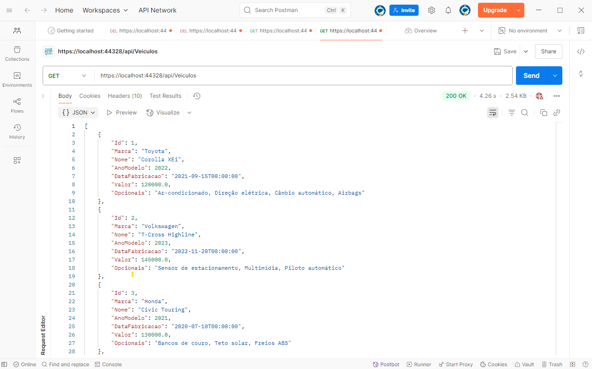

<h2>Projeto Concluído ✅ </h2>

🚗 API REST de Veículos – ASP.NET Web API + C#

Este projeto é uma API REST desenvolvida em ASP.NET Web API com C#, que permite o gerenciamento completo de veículos (CRUD).
Foi criada com foco em organização de código, boas práticas e facilidade de manutenção.

<h4>🔧 Tecnologias utilizadas</h4>
<ul>
    <li>C# com ASP.NET Web API (.NET Framework)</li>
    <li>SQL Server</li>
    <li>ADO.NET com SqlConnection e SqlCommand (acesso direto ao banco)</li>
    <li>Padrão Repositório para separar a lógica de negócios</li>
    <li>Tratamento de exceções com log personalizado (Utils.Logger)</li>
    <li>Testes realizados via Postman</li>
    <li>Roteamento RESTful (GET, POST, PUT, DELETE)</li>
</ul>

<h4>📬 Endpoints principais</h4>
<ul>
    <li>GET /api/Veiculos – Lista todos os veículos</li>
    <li>GET /api/Veiculos/{id} – Busca veículo por ID</li>
    <li>GET /api/Veiculos/{nome} – Busca por nome (mínimo 3 caracteres)</li>
    <li>POST /api/Veiculos – Adiciona um novo veículo</li>
    <li>PUT /api/Veiculos/{id} – Atualiza um veículo</li>
    <li>DELETE /api/Veiculos/{id} – Remove um veículo</li>
</ul>

<h4>💬 Contribuições</h4>
<Este>Sugestões, melhorias e pull requests são bem-vindos! Este projeto tem como objetivo ser simples, funcional e didático.
