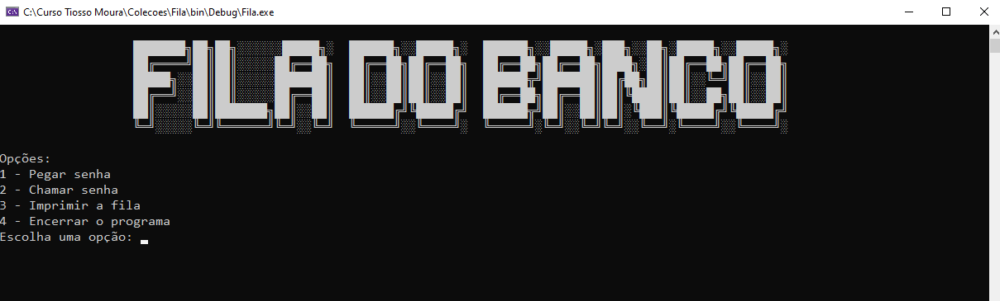

<h2>Projeto Concluído ✅ </h2>

<h4>Objetivo</h4>

O objetivo era criar um sistema simples de controle de fila para um banco, sem utilizar ferramentas que especificas como a Coleção Queue, utilizando apenas laços e arrays para testar nossa lógica de programação.

<ul>
    <li>Pegar uma senha (sequencial e limitada a 5 posições na fila)</li>
    <li>Chamar a próxima senha na ordem correta</li>
    <li>Imprimir a situação atual da fila</li>
    <li>Encerrar o programa somente quando a fila estiver vazia</li>

</ul>

Este exercício foi muito útil para reforçar conceitos fundamentais, como estrutura de dados, manipulação de arrays e controle de fluxo. Foi uma experiência prática e desafiadora que contribuiu bastante para aperfeiçoar minha lógica em programação!

