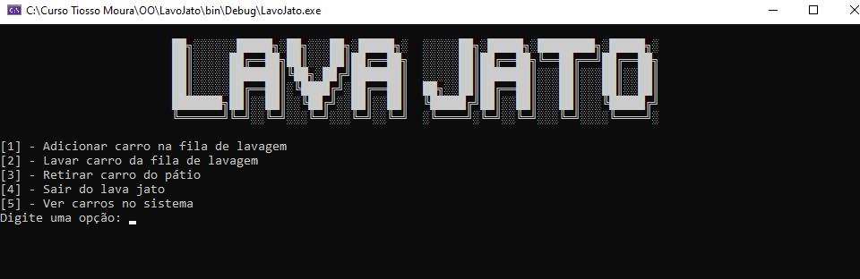

<h2>Projeto Concluído ✅ </h2>

<h4>Objetivo</h4>

O objetivo desse programa é simular a gestão de um lava-jato, com foco na aplicação de programação orientada a objetos (POO) e no uso de estruturas de dados para gerenciar as operações do dia a dia do estabelecimento.

<h4> Funcionalidades Principais</h4>
<ul>
    <li>Adiciona carros na fila e organiza os serviços a serem realizados.</li>
    <li>Carros são movidos da fila para o pátio de carros lavados.</li>
    <li>Permite ao usuário retirar carros prontos para entrega.</li>
    <li>Garantia de que o sistema só é encerrado quando não há carros aguardando ou no pátio.</li>
    <li>Exibe os carros na fila e no pátio para acompanhamento do processo.</li>

</ul>

Esse projeto foi uma excelente oportunidade para aplicar os conceitos de programação orientada a objetos (POO) e aprofundar meus conhecimentos em C#.

